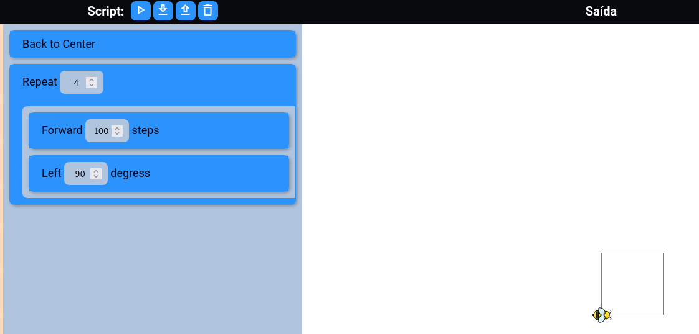
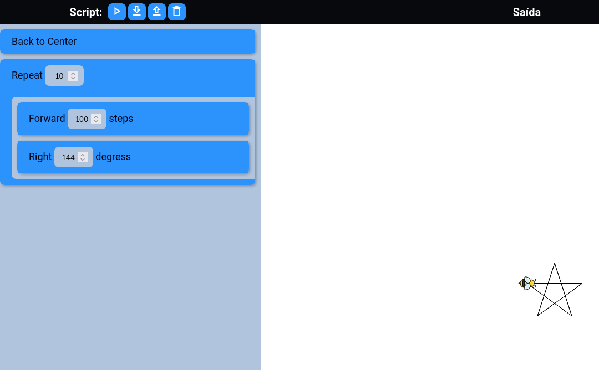
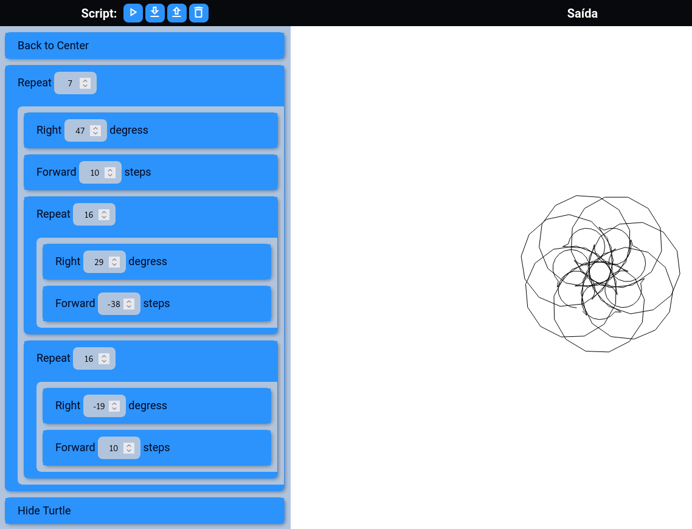

# Block Code

Este projeto é uma implementação do editor Block Code, conforme proposto no livro 500 Lines or Less. Block Code é uma ferramenta de programação gráfica onde os usuários criam programas organizando blocos que representam construções de código.

## Visão Geral

O editor Block Code permite que os usuários criem e visualizem programas simples usando blocos de código arrastáveis. Esses blocos são projetados especificamente para controlar uma tartaruga gráfica, uma ferramenta visual que se move pela tela para desenhar formas e padrões com base no código fornecido. Cada bloco representa uma construção de programação fundamental, como:

- **Repeat**: Permite repetir um conjunto de blocos um número específico de vezes.

- **Left**: Gira a tartaruga para a esquerda um número especificado de graus.

- **Right**: Gira a tartaruga para a direita um número especificado de graus.

- **Forward**: Move a tartaruga para frente um número especificado de passos.

- **Back**: Move a tartaruga para trás um número especificado de passos.

- **Circle**: Faz a tartaruga desenhar um círculo completo. O tamanho do círculo é determinado por um parâmetro.

- **PenUp**: Levanta a caneta, fazendo com que a tartaruga se mova sem deixar rastros.

- **PenDown**: Abaixa a caneta, fazendo com que a tartaruga desenhe ao se mover.

- **GotoCenter**: Move a tartaruga instantaneamente para o centro da tela. Ideal para recomeçar um desenho em um ponto específico.

- **HideTurtle**: Esconde/Mostra a tartaruga da tela, deixando apenas os desenhos visíveis.

## Funcionalidades

### Menu

- Permite arrastar e soltar blocos de código para a área de script, construindo assim a lógica do seu programa.

### Script

A área de script permite criar e editar programas de forma visual, arrastando e soltando blocos de código. É possível mover os blocos livremente pela tela, organizá-los em estruturas hierárquicas (aninhamento) e removê-los quando necessário.

O usuário pode executar o programa a qualquer momento, salvar o projeto em formato JSON para uso posterior e carregar projetos salvos anteriormente. Além disso, há um botão para resetar a área de trabalho, permitindo começar um novo projeto ou limpar o atual.

### Saida

Exibe o resultado da execução do script, respeitando os limites da área de visualização.

## Technologies

As seguintes tecnologias foram usadas para construir este projeto:

    HTML5
    CSS3
    JavaScript

## Instalação

Para executar o projeto Block Code localmente, siga estas etapas:

Obtendo o projeto

    git clone git@github.com:pedro-belo/block-code.git
    cd block-code

Instalação de dependências:

    cd assets
    npm install

Construindo

    npm run build

Rodando o servidor web

    # Considerando que você está no diretório assets
    cd ..
    npx http-server --port 56709

Acessando

    http://127.0.0.1:56709

## Exemplos de Uso

### Quadrado

Blocos

Código:

    [
        {
            "name": "gotoCenter"
        },
        {
            "name": "repeat",
            "value": 4,
            "children": [
                {
                    "name": "forward",
                    "value": 100
                },
                {
                    "name": "left",
                    "value": 90
                }
            ]
        }
    ]

### Estrela

Código

    [
        {
            "name": "gotoCenter"
        },
        {
            "name": "repeat",
            "value": 10,
            "children": [
                {
                    "name": "forward",
                    "value": 100
                },
                {
                    "name": "right",
                    "value": 144
                }
            ]
        }
    ]

### Exemplo do Livro

Código

    [
        {
            "name": "gotoCenter"
        },
        {
            "name": "repeat",
            "value": 7,
            "children": [
                {
                    "name": "right",
                    "value": 47
                },
                {
                    "name": "forward",
                    "value": 10
                },
                {
                    "name": "repeat",
                    "value": 16,
                    "children": [
                        {
                            "name": "right",
                            "value": 29
                        },
                        {
                            "name": "forward",
                            "value": -38
                        }
                    ]
                },
                {
                    "name": "repeat",
                    "value": 16,
                    "children": [
                        {
                            "name": "right",
                            "value": -19
                        },
                        {
                            "name": "forward",
                            "value": 10
                        }
                    ]
                }
            ]
        },
        {
            "name": "HideTurtle"
        }
    ]
